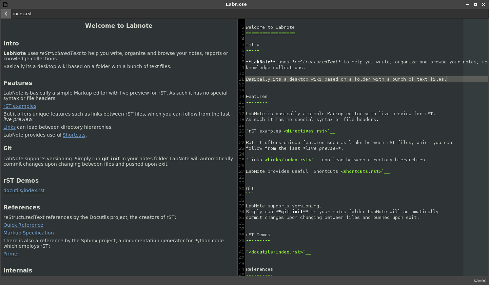

This project is superseded by [LabNote2](https://gitlab.gnome.org/phragment/labnote2)

**LabNote** is a reStructuredText editor with live preview intended to be used as desktop wiki.

It uses
[PyGObject](https://pygobject.readthedocs.io/en/latest/)
[GtkSourceView](https://wiki.gnome.org/Projects/GtkSourceView)
[Docutils](http://docutils.sourceforge.net/)
[WebKitGtk+ 2](https://webkitgtk.org/)

