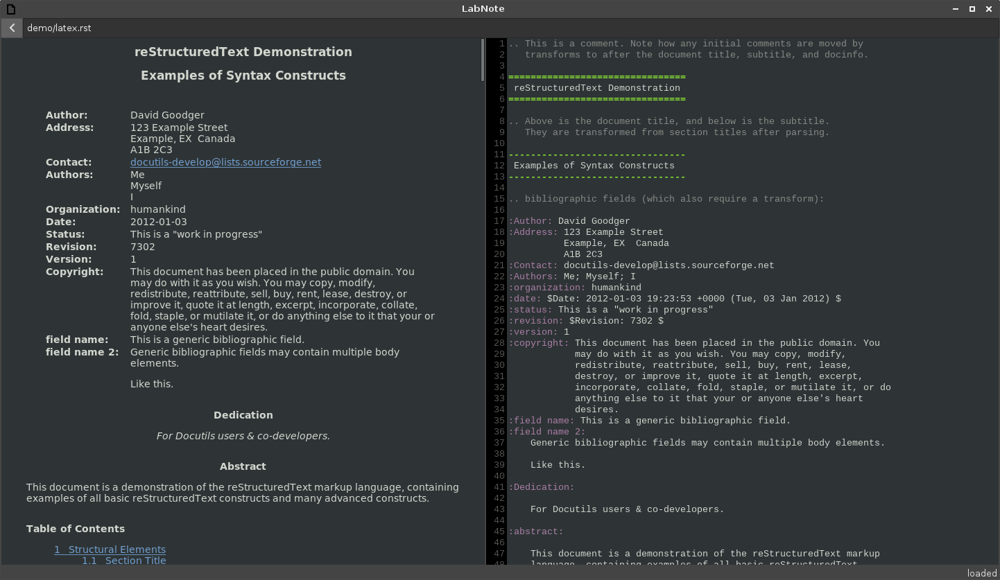

Small rST Directive Reference

.. sidebar:: Sidebar

  some stuff

.. math::

  c^2 = a^2 + b^2
  
  e^{j \pi} = -1
  
  \phi = arctan( \frac{Im}{Re} )

.. code:: python

  import antigravity
  
  print("test")

.. code:: c

  #include <stdio.h>
  
  int main() {
    print("foo\n");
    return 0;
  }

.. code:: sh

  if [ -x "$FILE" ];
    then
      echo ""
  fi

